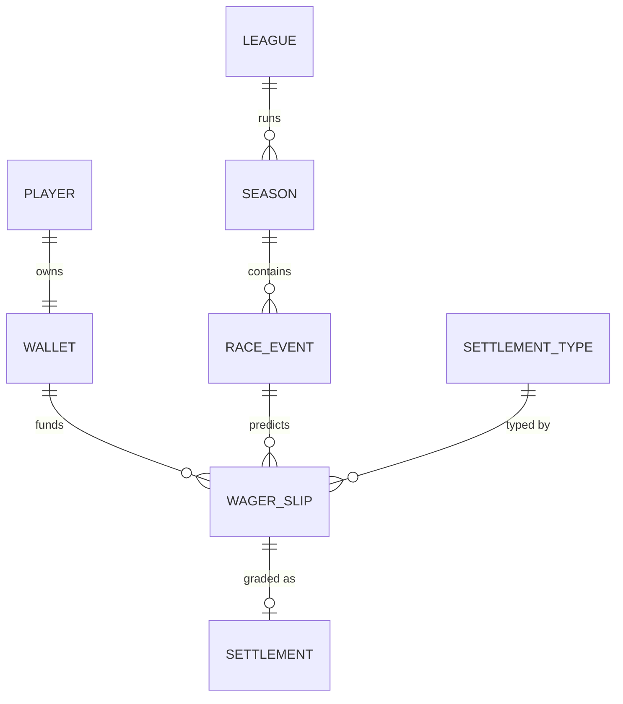

# Dynamics AI Intelligence Hub — Paddock Club (Punter) Artefact Pack

> **Version:** 0.4.2 (capstone experience elaboration — punter free-text markets)
>
> Elaborates the capstone user experience: a virtual-credit **predictions
> game** ("Paddock Club") inside the Dataverse model-driven app. This pack
> covers the **punter, free-text market** path only. Team-Principal mode is
> deferred to a later pack (Tier B).
>
> **v0.4.2 changes (API coverage sweep):** `safety_car_deployed` (type 13)
> now grounded on FastF1's coded `track_status` stream (Tier B,
> void-on-ambiguous), with OpenF1 `race_control` parsing as fallback;
> qualifying recognised as a second settleable surface reusing the existing
> registry unchanged; `stints`, the beta championship endpoints and the
> FastF1 Ergast/jolpica historical backend flagged as ML/RAG ingestion.
> Full inventory recorded in `docs/architecture/f1-data-source-coverage.md`.
>
> **v0.4.1 changes:** `pit_stops` (type 12) reclassified to Tier A / Results
> confidence (OpenF1 has a dedicated `/pit` endpoint with `pit_duration`);
> `driver_dnf` (type 7) confirmed as the Tier-A "crash" proxy; new
> FastF1-sourced `driver_crash` (type 15) added as a Tier-B, lower-confidence
> type that voids on ambiguous status; ADR-0008 gains a settlement
> source-of-truth / multi-source rule.
>
> **Decisions carried into this pack:**
> - The Settlement Capability Registry is **sized to what ingestion
>   supports** (grounded in OpenF1 endpoints below), and grows as Epic 4
>   ingestion coverage grows.
> - When free text cannot be mapped to a settlement type, the system
>   **rejects with guidance** (no silent accept, no manual-review queue in
>   Tier A).
> - **Virtual credits only.** No real money, no deposit/cash-out, no
>   betting terminology in UI or docs. Framed as a *predictions game*.
> - **The LLM proposes a settlement spec; code grades it.** No model is
>   ever asked "did this pay out?".
> - **Void, don't guess.** Missing/ambiguous data at settlement → void +
>   refund, never a fabricated result.
>
> **Contents:**
> 1. Concept recap and the free-text lifecycle
> 2. Settlement Capability Registry (grounded in OpenF1)
> 3. Data model additions
> 4. ADR-0008 draft (odds generation + free-text settlement contract)
> 5. Copy-paste-ready GitHub issue bodies
> 6. Upstream backlog amendments (Epic 3, 4, 7)

------------------------------------------------------------------------

## 1. Concept and free-text lifecycle

The punter types a plain-English prediction. The system does **not** hold a
fixed catalogue of markets; instead it maps the request onto an enumerable
set of settlement predicates it can grade from ingested data, prices it,
and produces a **wager slip** the punter confirms. After the race is
ingested, a settlement function grades each slip deterministically.

```
Punter free text  ("Norris to finish on the podium")
      │
      ▼
[ LLM + function calling — Epic 8 tool layer ]
  Maps request → a Settlement Type in the registry
  Extracts parameters (driver, operator, value)
  Prices odds (heuristic v1 / model v2)
      │
      ├─ mappable ──► Draft Wager Slip:
      │                 • restated prediction (plain English)
      │                 • settlement_type + parameters (JSON)
      │                 • frozen odds + stake field
      │                 • settleable = true
      │                 └─ punter confirms → credits debited, slip LOCKED
      │
      └─ not mappable ─► REJECT WITH GUIDANCE
                          "I can settle finishing positions, head-to-heads,
                           fastest lap, DNFs, winning margin, safety car and
                           rain. I can't settle 'best team radio'. Try …"
      ▼
(race session ingested + goes historical)
      ▼
[ Settlement Engine — timer-triggered Azure Function ]
  For each locked slip: load its spec → evaluate parameters against
  ingested facts (code, not LLM) → WIN / LOSE / VOID → adjust wallet
  Idempotent: re-runs after data correction never double-pay
```

The odds and the settlement spec are **frozen onto the slip at lock time**.
Later re-pricing or registry changes never alter a placed wager.

------------------------------------------------------------------------

## 2. Settlement Capability Registry (grounded in OpenF1)

Each type has (a) parameters, (b) an ingested source, (c) a deterministic
grading function, and (d) win/lose/void unit tests. "Confidence" indicates
how clean the grading logic is: **Results** types read the classification
endpoint directly; **Event** types require parsing logs and should be
added carefully.

| # | settlement_type | Parameters | OpenF1 source | Grading | Confidence |
|---|---|---|---|---|---|
| 1 | `driver_wins` | driver | `session_result` | position == 1 | Results |
| 2 | `podium_contains` | driver | `session_result` | position <= 3 | Results |
| 3 | `points_finish` | driver | `session_result` | position <= 10 (classified) | Results |
| 4 | `driver_finish_position` | driver, operator, value | `session_result` | operator(position, value) | Results |
| 5 | `head_to_head_finish` | driverA, driverB | `session_result` | classified higher wins | Results |
| 6 | `classified_finish` | driver | `session_result` | not dnf/dns/dsq | Results |
| 7 | `driver_dnf` | driver | `session_result` | dnf flag set | Results |
| 8 | `beats_grid` | driver | `starting_grid` + `session_result` | finish < start | Results |
| 9 | `positions_gained_at_least` | driver, n | `starting_grid` + `session_result` | (start − finish) >= n | Results |
| 10 | `fastest_lap_by` | driver | `laps` | min lap_duration is driver's | Results |
| 11 | `winning_margin` | operator, seconds | `session_result` | operator(P2 gap_to_leader, seconds) | Results |
| 12 | `pit_stops` | driver, operator, n | `pit` (dedicated endpoint, incl. `pit_duration`) | operator(count, n) | Results |
| 13 | `safety_car_deployed` | — | **FastF1 `track_status`** (preferred, coded) / OpenF1 `race_control` (fallback, parse) | coded SC/VSC value present, else SC/VSC message present | Enrichment (FastF1) / Event (parse) |
| 14 | `rain_during_session` | — | `weather` | any rainfall flag true | Event (parse) |
| 15 | `driver_crash` | driver | **FastF1** results `Status` == 'Crash' | status is a crash/accident cause; void if ambiguous | Enrichment (FastF1) |

**Tier A ships types 1–12** — all deterministic and gradable from OpenF1
alone (`session_result` / `starting_grid` / `laps` / `pit`). Type 12
`pit_stops` is promoted into Tier A because OpenF1 exposes pit stops on a
**dedicated `/pit` endpoint** (with `pit_duration`), so it's a clean count,
not a log-parsing job.

Type 14 (`weather`) remains a **registry growth story** added once that
ingestion is proven. Type 13 (`safety_car_deployed`) is best grounded
deterministically on **FastF1 `track_status`** (a coded SC/VSC/red stream)
rather than fuzzy `race_control` text parsing — the same FastF1 tradeoff as
`driver_crash`, so it too is Tier B and voids on ambiguity; the OpenF1
`race_control` parse remains the fallback if FastF1 is not ingested. This is
the "registry grows with ingestion" architecture in practice.

**Qualifying is a second settleable surface, nearly free.** Every Tier-A
type that reads `session_result` / `starting_grid` works on a *qualifying*
session key just as on a race one, so **pole position, "reach Q3" and
qualifying head-to-head** markets reuse the same grading functions with no
new machinery (FastF1 additionally exposes Q1/Q2/Q3 times for finer quali
markets). Treat qualifying markets as a configuration of the existing
registry against a different session, not new settlement code.

**Type 15 `driver_crash` is a Tier-B, FastF1-only type.** OpenF1's
`session_result` tells you *that* a driver DNF'd (the `dnf` flag → type 7)
but not *why*; only FastF1's results `Status` column distinguishes a crash
from a mechanical failure. Grading it therefore takes a **FastF1
dependency** (Pandas-heavy, cached, slower than a single OpenF1 REST call),
so it is held for Tier B and **voids rather than guesses** when the status
is missing or ambiguous. Punters wanting a "crash" bet in Tier A get the
honest, deterministic `driver_dnf` (type 7) instead. See ADR-0008 §Decision
for the multi-source settlement rule.

**Driver identity note:** OpenF1 keys on `driver_number`; free text uses
names ("Norris"). The intake tool resolves name → `driver_number` against
the ingested `drivers` entry list for the event, and if it cannot resolve
unambiguously it **rejects with guidance** rather than guessing.

------------------------------------------------------------------------

## 3. Data model additions (client-agnostic)



| Table | Purpose | Key columns |
|---|---|---|
| League | Grouping for players | name, commissioner |
| Season | Maps to an F1 season | year, league |
| Race Event | One race weekend | meeting/session keys (OpenF1), status (Open/Locked/Settled), lock deadline |
| Player | App user profile in the game | user (systemuser lookup), display name |
| Wallet | Virtual-credit balance | player, balance (rollup of settlements), starting stake |
| Settlement Type | The registry (reference data) | code, label, parameter schema, tier |
| Wager Slip | The placed prediction | race event, player, restated text, settlement_type, parameters (JSON), frozen odds, stake, status (Draft/Locked/Won/Lost/Void) |
| Settlement | Grading outcome | wager slip, result, payout, graded-on, data snapshot ref |

Wallet balance is a **rollup column** over settlements → free leaderboard
view + dashboard chart, no custom code. Parameters and the frozen odds live
on the Wager Slip as a JSON column + a decimal column so a placed wager is
fully self-contained for settlement and audit.

------------------------------------------------------------------------

## 4. ADR-0008 (draft)

```
# ADR-0008: Odds generation and free-text wager settlement contract

## Status
Proposed

## Context
The Paddock Club punter experience accepts free-text predictions rather
than a fixed market catalogue. Two problems must be solved safely:
(1) pricing arbitrary predictions, and (2) grading them deterministically
from ingested data at the end of the race. An LLM can plausibly price and
restate a prediction, but must never be trusted to decide whether a bet
paid out — that would be ungrounded and non-reproducible. Free text also
risks producing unsettleable bets that can never be graded.

## Decision
1. Free text is mapped, at slip-creation time, onto a Settlement Type from
   an enumerable Settlement Capability Registry, using LLM function calling
   with structured output. The registry is sized to what ingestion
   supports and grows with it.
2. Each Settlement Type has a deterministic grading function that reads
   ingested data — no LLM involvement at settlement.
3. SETTLEMENT SOURCE OF TRUTH is OpenF1 for Tier A. Its `session_result`,
   `starting_grid`, `laps` and dedicated `/pit` endpoints grade all Tier-A
   types via a single lightweight REST-ingested path. A type may only take
   a heavier source (e.g. FastF1) when OpenF1 genuinely cannot ground it:
   `driver_crash` (type 15) needs FastF1's results `Status`, and
   `safety_car_deployed` (type 13) is best grounded on FastF1's coded
   `track_status` stream rather than fuzzy `race_control` text (the OpenF1
   parse remains a fallback). Such multi-source types are Tier B, are
   flagged FastF1-dependent, and VOID when the source is missing or
   ambiguous rather than inferring. Punters get the deterministic
   `driver_dnf` (type 7, OpenF1) in Tier A. The same registry types grade
   **qualifying** sessions unchanged (pole, reach-Q3, quali head-to-head)
   by pointing at a qualifying session key — no new grading code.
4. If free text cannot be mapped to a registry type (or a driver cannot be
   resolved), the request is REJECTED WITH GUIDANCE listing supported
   prediction kinds. No silent accept; no manual-review queue in Tier A.
5. Odds are generated v1 by a recent-form heuristic and v2 by the Epic 7
   probability model; both write the same odds field, flagged by source.
   Odds and the settlement spec are FROZEN onto the slip at lock time.
6. Settlement is VOID-ON-MISSING-DATA: if required ingested facts are
   absent or ambiguous, the slip is voided and the stake refunded — never
   graded on a guess.
7. Settlement is IDEMPOTENT: re-running after an upstream data correction
   (revised lap times, post-race disqualification) must reconcile to the
   correct result without double-paying.
8. Virtual credits only. No real currency, deposit, cash-out, or betting
   terminology anywhere in the app or documentation.

## Options Considered
1. Fixed market catalogue (no free text) — simplest to settle, but loses
   the LLM/structured-output/function-calling showcase and the engagement
   hook. Rejected as the primary design; retained as the fallback shape.
2. Free text priced AND graded by the LLM — richest UX, but ungrounded,
   non-reproducible settlement. Rejected on safety and portfolio-integrity
   grounds.
3. Free text → structured spec (LLM), graded by code (CHOSEN) — keeps the
   AI showcase where it is trustworthy (intake) and keeps grading
   deterministic and auditable.

## Consequences
Positive: strong structured-output + function-calling deliverable; grading
is testable and reproducible; ingestion correctness gains real
consequence; a clean "we know where not to trust the model" governance
story for the Responsible AI assessment (11.B).
Negative: intake must handle mapping failures gracefully; the registry and
ingestion coverage are coupled and must be versioned together; settlement
statefulness (idempotency, void) is the first real business logic in the
project and needs careful tests; multi-source types (FastF1 for
`driver_crash`) add a heavier, slower settlement path and a second data
dependency, so they are deliberately isolated to Tier B.

## Follow-up Actions
- [ ] Seed the Settlement Type registry (types 1–11) as reference data
- [ ] Add the settlement-completeness acceptance criterion to Epic 4
      ingestion (entry list + session_result must be present to settle)
- [ ] Record the virtual-credits framing in the Responsible AI note (11.B)
```

------------------------------------------------------------------------

## 5. GitHub issue bodies (copy-paste-ready)

------------------------------------------------------------------------

### Issue 12.PA-1 — Story: Paddock Club punter schema (League → Wager Slip)

**Type:** Story
**Feature:** Paddock Club (Gamified Experience Layer)
**Story Points:** 5
**Priority:** High (foundation for the whole punter experience)
**Milestone:** Month 2 — Dataverse and Dynamics Foundation
**Labels:** `story`, `dataverse`, `dynamics`, `portfolio`
**Suggested branch:** `feat/paddock-club-schema`
**Suggested PR title:** `feat(dataverse): Paddock Club punter tables and relationships`

#### User Story

As a learner, I want the punter-mode tables created alongside the Epic 3
data model so that wagers, wallets and settlements accumulate real audit
history and are covered by seeding from the start.

#### Goal

Dataverse tables and relationships for League, Season, Race Event, Player,
Wallet, Settlement Type, Wager Slip and Settlement, wired into the
model-driven app.

#### Business Value

Provides the transactional spine of the capstone experience; produces a
high-volume, realistic audit trail that materially strengthens the Epic 6–7
audit-anomaly work.

#### Learning Value

Normalised schema design for a transactional domain, rollup columns, and
JSON columns for typed parameters.

#### Dependencies

- **Requires:** Epic 3 data model & ERD, Epic 3 Dataverse tables feature
- **Blocks:** all other Paddock Club stories; the Epic 4 settlement engine

#### Tasks

- [ ] Model League, Season, Race Event (with OpenF1 meeting/session keys
      and status Open/Locked/Settled + lock deadline)
- [ ] Model Player (systemuser lookup), Wallet (balance as rollup, starting
      stake)
- [ ] Model Settlement Type as reference data (code, label, parameter
      schema, tier)
- [ ] Model Wager Slip (race event, player, restated text, settlement_type,
      parameters JSON, frozen odds decimal, stake, status)
- [ ] Model Settlement (wager slip, result, payout, graded-on, data
      snapshot ref)
- [ ] Configure relationships, alternate keys and the Wallet balance rollup
- [ ] Surface tables in the model-driven app sitemap under a "Paddock Club"
      area
- [ ] Update the ERD and record the schema in the Epic 3 ADR

#### SMART Acceptance Criteria

- [ ] **Specific:** All eight tables exist with the relationships above.
- [ ] **Measurable:** A wager slip can be created against a race event and
      linked to a player and wallet; the wallet balance rollup reflects a
      test settlement.
- [ ] **Achievable:** Standard Dataverse modelling; no code.
- [ ] **Relevant:** Foundation for the capstone experience and audit
      volume.
- [ ] **Time-bound:** Complete within Month 2.

#### Definition of Ready

- [ ] Epic 3 ERD approved
- [ ] Settlement Type list (types 1–11) agreed

#### Definition of Done

- [ ] Tables, relationships, rollup and sitemap area created
- [ ] ERD updated; schema ADR entry recorded

#### Deliverables

- Dataverse solution with the Paddock Club tables
- Updated `docs/architecture` ERD

#### Learning Resources

- **Microsoft Learn — Create and edit tables in Dataverse:** use for table
  and relationship modelling.
- **Microsoft Learn — Define rollup columns:** use for the wallet balance.

------------------------------------------------------------------------

### Issue 12.PA-2 — Story: Settlement Capability Registry and grading functions

**Type:** Story
**Feature:** Paddock Club (Gamified Experience Layer)
**Story Points:** 5
**Priority:** High (the make-or-break settlement foundation)
**Milestone:** Month 5 — Generative AI, RAG and Agents
**Labels:** `story`, `python`, `openf1`, `portfolio`
**Suggested branch:** `feat/settlement-registry`
**Suggested PR title:** `feat(paddock): settlement type registry and deterministic grading`

#### User Story

As a learner, I want each settlement type to have a deterministic grading
function with win/lose/void tests so that placed wagers are graded from
ingested data reproducibly and never by the model.

#### Goal

A Python module implementing grading functions for Settlement Types 1–12
(the Tier-A set), each reading ingested OpenF1 data
(`session_result` / `starting_grid` / `laps` / `pit`) and returning
WIN / LOSE / VOID, plus a seed for the Settlement Type reference records.

#### Business Value

Guarantees settlement is deterministic and auditable — the trust anchor of
the whole punter experience.

#### Learning Value

Deterministic evaluation over log-shaped API data (aggregating to latest
classification per driver), transient-vs-missing data handling, thorough
unit testing.

#### Dependencies

- **Requires:** 12.PA-1 schema; Epic 4 ingestion of `session_result`,
  `starting_grid`, `laps`, `pit`; Epic 3 Dataverse access layer
- **Consumed by:** 12.PA-4 settlement engine, 12.PA-3 intake tool
- **Note:** the FastF1-sourced `driver_crash` (type 15) is **out of scope**
  here; it lands in Tier B with its own FastF1 ingestion and void rule

#### Tasks

- [ ] Define the parameter schema for each of types 1–12
- [ ] Implement each grading function against ingested data (not live API)
- [ ] Implement `pit_stops` from the OpenF1 `/pit` endpoint (stop count per
      driver; `pit_duration` available for future duration markets)
- [ ] Implement driver name → `driver_number` resolution against the event
      entry list; unresolved → VOID/reject signal
- [ ] Handle missing/ambiguous data by returning VOID (never a guess)
- [ ] Seed the Settlement Type reference records
- [ ] Unit tests per type: a winning case, a losing case, and a
      void-on-missing-data case
- [ ] Document each type's parameters and grading rule

#### SMART Acceptance Criteria

- [ ] **Specific:** Types 1–12 each have a grading function and reference
      record.
- [ ] **Measurable:** Every type has passing win / lose / void unit tests
      (≥ 36 tests total); no type reads the live API at grade time.
- [ ] **Achievable:** Pure functions over already-ingested data.
- [ ] **Relevant:** The deterministic core the design depends on.
- [ ] **Time-bound:** Complete within Month 5, before 12.PA-4.

#### Definition of Ready

- [ ] Schema (12.PA-1) merged
- [ ] Sample ingested `session_result` fixtures available for tests

#### Definition of Done

- [ ] All grading functions merged with win/lose/void tests; green CI
- [ ] Settlement Type records seeded
- [ ] Registry documented

#### Deliverables

- `src/paddock/settlement/registry.py` and grading functions
- `tests/paddock/test_grading.py`
- Seed script for Settlement Type records
- `docs/architecture/settlement-registry.md`

#### Learning Resources

- **OpenF1 — Session result endpoint:** use to confirm the classification,
  DNF and gap-to-leader fields grading relies on.
- **OpenF1 — Starting grid / Laps endpoints:** use for grid-based and
  fastest-lap grading.
- **OpenF1 — Pit endpoint:** use for pit-stop counts and `pit_duration`.
- **pytest — parametrised tests:** use for the per-type win/lose/void
  cases.

------------------------------------------------------------------------

### Issue 12.PA-3 — Story: Free-text wager intake (LLM → structured slip)

**Type:** Story
**Feature:** Paddock Club (Gamified Experience Layer)
**Story Points:** 8
**Priority:** High (the headline AI interaction)
**Milestone:** Month 5 — Generative AI, RAG and Agents
**Labels:** `story`, `python`, `azure`, `rag`, `portfolio`, `governance`
**Suggested branch:** `feat/wager-intake`
**Suggested PR title:** `feat(paddock): free-text wager intake with function calling and structured slip`

#### User Story

As a punter, I want to type a plain-English prediction and receive a priced,
confirmable wager slip so that I can bet on anything the system can settle,
without picking from a fixed menu.

#### Goal

An intake capability that takes free text, uses Azure OpenAI function
calling to map it to a Settlement Type with parameters, prices it, and
returns either a draft Wager Slip or a rejection with guidance.

#### Business Value

The engaging front door to the experience and a strong structured-output +
function-calling portfolio piece.

#### Learning Value

Function calling, structured outputs, grounding a model's proposal against a
constrained registry, and prompt/response logging.

#### Dependencies

- **Requires:** 12.PA-2 registry; Epic 8 Azure OpenAI integration, function
  calling, structured outputs, prompt/response logging; (optional) Epic 9
  RAG for form context
- **Blocks:** 12.PA-5 confirm/lock flow

#### Tasks

- [ ] Define function/tool schemas exposing the registry types and their
      parameters to the model
- [ ] Prompt the model to map free text to exactly one type or decline
- [ ] Validate the model's structured output against the parameter schema
- [ ] Resolve driver names to numbers; on failure, reject with guidance
- [ ] Price the mapped prediction (call the odds function — 12.PA-6)
- [ ] Produce a draft Wager Slip (restated text, type, parameters, frozen
      odds) or a REJECT-WITH-GUIDANCE response listing supported kinds
- [ ] Log prompt/response to the AI Request / AI Response entities (Epic 8)
- [ ] Tests: mappable inputs produce valid slips; unmappable inputs are
      rejected with guidance; malformed model output is rejected safely

#### SMART Acceptance Criteria

- [ ] **Specific:** Free text yields either a schema-valid draft slip or a
      guided rejection.
- [ ] **Measurable:** For a fixed test set, every mappable phrase produces a
      valid slip and every unmappable phrase is rejected with guidance;
      100% of produced slips validate against the parameter schema.
- [ ] **Achievable:** Reuses the Epic 8 tool layer; no new model plumbing.
- [ ] **Relevant:** Core AI showcase for the capstone.
- [ ] **Time-bound:** Complete within Month 5.

#### Definition of Ready

- [ ] Registry (12.PA-2) merged
- [ ] Epic 8 function calling and logging available

#### Definition of Done

- [ ] Intake merged with the test set passing; green CI
- [ ] Prompt/response logging verified
- [ ] Documented, including the supported-kinds guidance message

#### Deliverables

- `src/paddock/intake.py`
- `tests/paddock/test_intake.py`
- `docs/architecture/wager-intake.md`

#### Learning Resources

- **Microsoft Learn — Function calling with Azure OpenAI:** use for the
  tool-schema mapping.
- **Microsoft Learn — Structured outputs with Azure OpenAI:** use to
  constrain the model to the parameter schema.

------------------------------------------------------------------------

### Issue 12.PA-4 — Story: Settlement engine (idempotent, void-on-missing)

**Type:** Story
**Feature:** Paddock Club (Gamified Experience Layer)
**Story Points:** 8
**Priority:** High (closes the loop)
**Milestone:** Month 5 — Generative AI, RAG and Agents
**Labels:** `story`, `python`, `azure`, `portfolio`, `governance`
**Suggested branch:** `feat/settlement-engine`
**Suggested PR title:** `feat(paddock): idempotent settlement function grading locked wagers`

#### User Story

As a punter, I want my locked wagers graded automatically after the race so
that wallets update correctly and reproducibly, with unsettleable bets
refunded rather than guessed.

#### Goal

A timer-triggered Azure Function that, once a race session is ingested and
historical, grades each locked Wager Slip via the registry, writes a
Settlement, adjusts the wallet, and is safe to re-run.

#### Business Value

Completes the play loop and demonstrates stateful, correct, auditable
business logic on the serverless platform.

#### Learning Value

Idempotent processing, void/refund semantics, reconciliation after upstream
data correction, timer triggers on Azure Functions.

#### Dependencies

- **Requires:** 12.PA-2 grading functions; 12.PA-1 schema; Epic 4 serverless
  platform and ingestion; Epic 3 Dataverse access layer
- **Blocks:** Epic 12 integration demo; wager-anomaly analytics

#### Tasks

- [ ] Timer trigger that finds Race Events with ingested results and locked,
      ungraded slips
- [ ] For each slip: load spec → call the grading function → WIN/LOSE/VOID
- [ ] Write a Settlement record (result, payout, graded-on, data snapshot
      reference) and adjust the wallet
- [ ] Make settlement idempotent (a slip is graded at most once; re-runs
      reconcile, never double-pay)
- [ ] Handle upstream corrections: re-grading a corrected result reconciles
      the wallet to the right balance
- [ ] Void + refund any slip whose data is missing/ambiguous
- [ ] Emit run metrics (settled, voided, reconciled) via shared logging
- [ ] Tests: idempotent re-run; correction reconciliation; void-refund path

#### SMART Acceptance Criteria

- [ ] **Specific:** Locked slips for an ingested race are graded to
      WIN/LOSE/VOID with wallet updates.
- [ ] **Measurable:** Running the function twice on the same race produces
      identical balances (no double-pay); a simulated result correction
      reconciles to the corrected balance; a slip with missing data is
      voided and refunded.
- [ ] **Achievable:** Reuses the Epic 4 platform and 12.PA-2 grading.
- [ ] **Relevant:** The capability that makes the whole experience real.
- [ ] **Time-bound:** Complete within Month 5.

#### Definition of Ready

- [ ] Grading functions (12.PA-2) merged
- [ ] Epic 4 ingestion producing `session_result` for a test event

#### Definition of Done

- [ ] Function merged; idempotency, reconciliation and void tests pass
- [ ] Run metrics visible; green CI
- [ ] Documented

#### Deliverables

- `src/azure_functions/settlement/` (timer function)
- `tests/paddock/test_settlement_engine.py`
- `docs/architecture/settlement-engine.md`

#### Learning Resources

- **Microsoft Learn — Timer trigger for Azure Functions (Python):** use for
  the scheduled settlement run.
- **Microsoft Learn — Azure Functions Python developer guide:** use for the
  function project structure and configuration.

------------------------------------------------------------------------

### Issue 12.PA-5 — Story: Confirm-and-lock flow with credit debit

**Type:** Story
**Feature:** Paddock Club (Gamified Experience Layer)
**Story Points:** 3
**Priority:** Medium
**Milestone:** Month 5 — Generative AI, RAG and Agents
**Labels:** `story`, `dataverse`, `dynamics`, `python`, `portfolio`
**Suggested branch:** `feat/wager-confirm-lock`
**Suggested PR title:** `feat(paddock): confirm-and-lock wager flow with credit debit and deadline`

#### User Story

As a punter, I want to review a draft slip and confirm it so that credits
are debited and the wager is locked with its odds frozen, but only before
the race lock deadline.

#### Goal

The transition from draft slip to locked wager: freeze odds and spec, debit
the stake from the wallet, enforce the Race Event lock deadline, and block
further edits.

#### Business Value

Makes wagers binding and fair; enforces the deadline that keeps settlement
honest.

#### Learning Value

State transitions and simple guarded business logic in Dataverse / a small
function.

#### Dependencies

- **Requires:** 12.PA-1 schema, 12.PA-3 intake (produces draft slips)
- **Blocks:** 12.PA-4 (only locked slips are settled)

#### Tasks

- [ ] Implement the Draft → Locked transition (freeze odds + parameters)
- [ ] Debit the stake from the wallet on lock; reject if funds insufficient
- [ ] Reject lock attempts after the Race Event lock deadline
- [ ] Prevent edits to a locked slip
- [ ] Tests: successful lock/debit; insufficient funds; post-deadline
      rejection

#### SMART Acceptance Criteria

- [ ] **Specific:** A draft slip can be locked before the deadline, debiting
      the stake and freezing odds.
- [ ] **Measurable:** Locking debits exactly the stake; a post-deadline or
      underfunded lock is rejected; a locked slip cannot be edited.
- [ ] **Achievable:** Standard state/rollup logic.
- [ ] **Relevant:** Fairness and settlement integrity.
- [ ] **Time-bound:** Complete within Month 5.

#### Definition of Ready

- [ ] Intake (12.PA-3) producing draft slips

#### Definition of Done

- [ ] Lock flow merged with tests; green CI; documented

#### Deliverables

- Lock logic (plug-in, low-code flow, or small function — record the choice)
- `tests/paddock/test_lock_flow.py`

#### Learning Resources

- **Microsoft Learn — Business rules and logic in Dataverse:** use for
  guarded state transitions.

------------------------------------------------------------------------

### Issue 12.PA-6 — Story: Odds pricing v1 (recent-form heuristic)

**Type:** Story
**Feature:** Paddock Club (Gamified Experience Layer)
**Story Points:** 3
**Priority:** Medium
**Milestone:** Month 5 — Generative AI, RAG and Agents
**Labels:** `story`, `python`, `openf1`, `portfolio`
**Suggested branch:** `feat/odds-heuristic`
**Suggested PR title:** `feat(paddock): recent-form heuristic odds pricing (v1)`

#### User Story

As a punter, I want each prediction priced so that a wager slip shows odds,
even before any ML model exists.

#### Goal

A heuristic pricer that returns odds for each settlement type from recent
ingested finishing positions plus a configurable house margin, writing to
the slip's frozen-odds field with a `source = heuristic` flag.

#### Business Value

Ships the punter loop in Month 5 regardless of ML progress; the same field
is later fed by the Epic 7 model (`source = model`) — the before/after
narrative.

#### Learning Value

Turning historical positions into probabilities and margined odds; keeping
a stable pricing interface behind swappable implementations.

#### Dependencies

- **Requires:** 12.PA-2 registry; Epic 4 ingested results history
- **Consumed by:** 12.PA-3 intake
- **Upgraded by:** Epic 7 odds-model story (v2)

#### Tasks

- [ ] Compute recent-form probabilities per type from ingested results
- [ ] Apply a configurable house margin to derive odds
- [ ] Expose a stable `price(settlement_type, parameters)` interface
- [ ] Tag output `source = heuristic`
- [ ] Tests: plausible ordering (a form favourite is shorter-priced than a
      backmarker); margin applied correctly

#### SMART Acceptance Criteria

- [ ] **Specific:** Every Tier-A type returns odds via one interface.
- [ ] **Measurable:** For seeded data, a clear favourite prices shorter than
      a clear outsider; the house margin is present and configurable.
- [ ] **Achievable:** Simple aggregation, no ML.
- [ ] **Relevant:** Unblocks the punter loop independently of Epic 7.
- [ ] **Time-bound:** Complete within Month 5.

#### Definition of Ready

- [ ] Registry (12.PA-2) merged; results history ingested

#### Definition of Done

- [ ] Pricer merged with tests; green CI; interface documented for the
      Epic 7 model to implement

#### Deliverables

- `src/paddock/odds.py` (heuristic + interface)
- `tests/paddock/test_odds.py`

#### Learning Resources

- **OpenF1 — Session result / Position endpoints:** use for the recent-form
  inputs.

------------------------------------------------------------------------

## 6. Upstream backlog amendments

These are edits to existing epics rather than new stories — apply them so
the punter experience is properly supported.

### Epic 3 — Sample CRM Data & Seeding
Add a task: seed Leagues, Seasons, Players, Wallets (starting credit) and a
handful of historical Race Events so the experience is demonstrable and the
audit trail has volume from Month 2.

### Epic 4 — Ingestion Client / Dataverse Persistence
Add an acceptance criterion: for any Race Event to be settleable, ingestion
must land the entry list (`drivers`) and `session_result`; add
`starting_grid`, `laps` and the dedicated `pit` endpoint to cover all
**Tier-A** types (1–12). Ingest `weather` for growth type 14. The
FastF1-sourced types — `driver_crash` (15, results `Status`) and the
preferred grounding for `safety_car_deployed` (13, `track_status`) — need a
separate FastF1 ingestion path in Tier B; note it as a distinct, heavier
settlement path, not part of the OpenF1 REST flow (the OpenF1 `race_control`
parse stays as the type-13 fallback). Also add a criterion that ingestion
works against a **qualifying** session key, so qualifying markets settle on
the same path as race markets.
Add a task: ingest `stints` (tyre compound/age) as first-class, not
"as needed" — it feeds Epic 7 strategy features and Tier-B setup scoring.

### F1 data-source coverage reference
Full inventory of both APIs, the source-selection rules, and per-epic
opportunities are recorded in
`docs/architecture/f1-data-source-coverage.md`. New ingestion targets from
that sweep: OpenF1 `stints` and the beta championship endpoints, and the
FastF1 Ergast/jolpica backend for pre-2023 historical depth (ML training and
RAG facts).

### Epic 7 — Anomaly Detection (retarget) + new Odds Model story
Retarget audit-anomaly detection to **wager-pattern anomalies** (burst
placing, improbable streaks, atypical stake patterns) over the Wager Slip /
Settlement data — a stronger, more concrete fraud-style story than generic
CRM churn.
Add a story: **Odds model (v2)** — a calibrated winner/podium probability
model that implements the 12.PA-6 pricing interface and writes odds with
`source = model`; acceptance criterion includes a calibration curve and a
comparison against the heuristic. Feature inputs should draw on the newly
flagged sources: `stints` (tyre compound/age) for strategy context,
championship standings for race-context features, and the FastF1
Ergast/jolpica backend for pre-2023 historical form depth.

### Epic 11 — Responsible AI (11.B)
Add to the assessment: record the **virtual-credits, no-real-money**
framing and the **"LLM proposes, code grades, void-don't-guess"** settlement
rule as explicit, deliberate risk mitigations.
