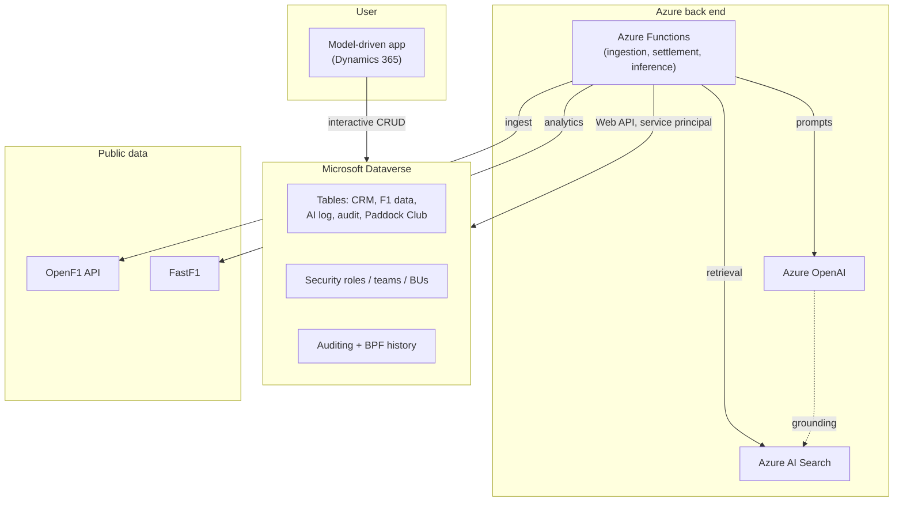
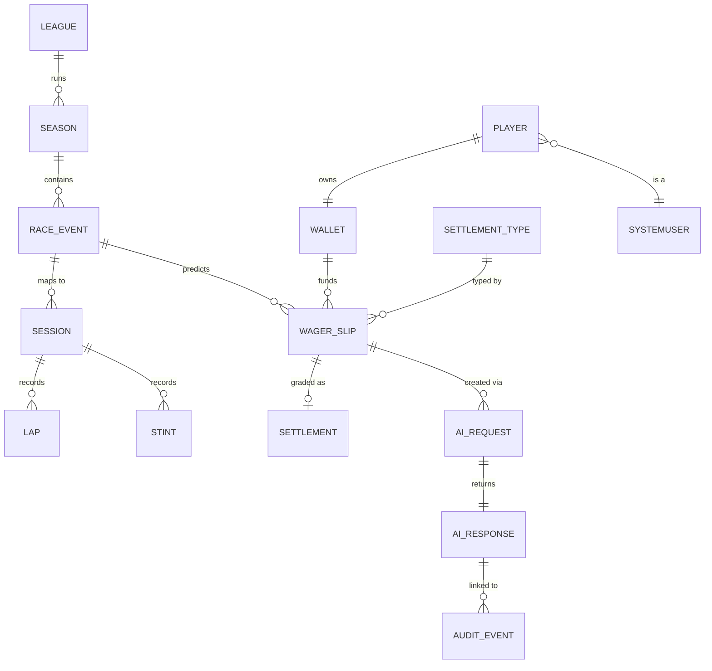
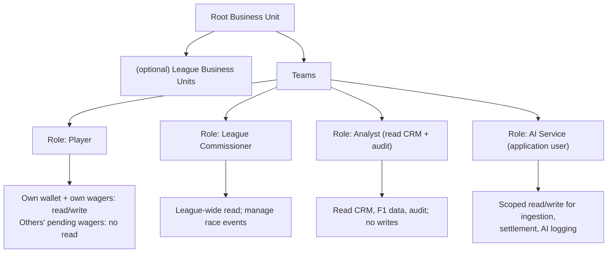

# Dynamics AI Intelligence Hub — Dynamics / Dataverse Technical Documentation

> **Version:** 0.2
> **Location in repo:** `docs/architecture/dynamics-dataverse.md`
> **Scope:** The Dynamics 365 / Dataverse layer of the whole solution —
> data model, security, model-driven app, business-logic placement,
> auditing, and the integration surface to the Azure / AI components. The
> Paddock Club predictions game is included as a first-class part of the
> model, not a bolt-on.
> **Audience:** the author (portfolio owner) and any reviewer assessing the
> solution as an architecture artefact.
> **Client-agnostic:** all entities and roles are generic CRM / F1-public
> constructs; no customer, employer or proprietary domain is referenced.

------------------------------------------------------------------------

## 1. Purpose and scope

This document describes how Dataverse is used as the **system of record and
presentation layer** for the solution. Dataverse holds the generic CRM
domain, the ingested F1 public data, the AI interaction log, the audit
history, and the Paddock Club predictions-game data. A model-driven app is
the human front end; Azure Functions and Azure AI services are the
compute/AI back end that read and write Dataverse through its Web API.

Out of scope here (covered in their own documents): Azure Functions
internals, the RAG pipeline, the agent workflow, IaC, and CI/CD.

------------------------------------------------------------------------

## 2. Solution context

Dataverse sits in the middle: the app talks to it directly; Azure services
talk to it through the Web API using an application (service-principal)
identity.



**Design principle:** Dataverse is authoritative for *state* (records,
balances, statuses, the AI log). Azure Functions own *behaviour* (ingest,
grade, infer). No business logic that must be reproducible or audited is
placed in an LLM — the model proposes, code and Dataverse decide.

------------------------------------------------------------------------

## 3. Solution and ALM strategy

| Aspect | Decision | Rationale |
|---|---|---|
| Publisher | One custom publisher with the prefix `racy` (logical-name prefix `racy_`) | Consistent schema names; avoids the default publisher |
| Solution packaging | Author in an **unmanaged** solution in Dev; export **managed** for downstream | Standard Microsoft ALM; managed elsewhere prevents drift |
| Environments | Dev → (Test) → Prod, tracked in `infrastructure/environments` | Promotion path; matches Epic 12 Deployment CI/CD |
| Source control | Solution unpacked to source (Solution Packager / `pac`) and committed | Reviewable schema diffs; the portfolio shows real ALM |
| Environment variables | Used for all environment-specific values (endpoints, keys via Key Vault refs) | No hard-coded config; ties to Epic 11 secrets story |

This layer is where the repo's **ADR-0002 (IaC tool)** and **ADR-0003
(Dataverse auth)** decisions land in practice.

------------------------------------------------------------------------

## 4. Data model

### 4.1 Entity groups

The model is organised into five groups. All custom tables share the
publisher prefix.

| Group | Tables | Notes |
|---|---|---|
| CRM core | Account, Contact, Lead, Opportunity, Case, Activity, Product, Knowledge Article, Document | Generic CRM; several map to standard Dataverse tables where sensible |
| F1 public data | Meeting, Session, Driver, Lap, Stint, Session Result, Starting Grid, Championship Standing | Ingested from OpenF1 (settlement + core); `Stint` is first-class (tyre compound/age for strategy ML); standings from the beta championship endpoints. Keyed on OpenF1 identifiers. See the coverage reference below |
| AI interaction | AI Request, AI Response | Every model call logged; linked to the audit trail |
| Audit | Audit Event (+ platform audit + BPF history) | Enterprise-style audit dataset for Epics 6–7 |
| Paddock Club | League, Season, Race Event, Player, Wallet, Settlement Type, Wager Slip, Settlement | Predictions game; transactional volume for audit analytics |

### 4.2 Ownership and keys

- **Ownership:** CRM core, Paddock Club transactional tables (Wallet, Wager
  Slip) and AI interaction tables are **user/team-owned** so security roles
  can scope them. F1 public data and Settlement Type (reference data) are
  **organisation-owned** — they aren't per-user.
- **Alternate keys:** F1 tables use OpenF1 identifiers (e.g. session key +
  driver number) as alternate keys so ingestion upserts are idempotent.
  Race Event carries the OpenF1 meeting/session keys as an alternate key.
- **Choice columns:** statuses (Race Event `Open/Locked/Settled`, Wager Slip
  `Draft/Locked/Won/Lost/Void`, Settlement `Won/Lost/Void`) are local
  choices, not free text.

### 4.3 Entity-relationship diagram (Paddock Club + AI + audit)



Key columns worth noting:
- **Wager Slip** carries the *frozen* odds (decimal) and the *parameters*
  (JSON) so a placed wager is self-contained for settlement and audit —
  later re-pricing or registry changes never touch a placed wager.
- **Wallet balance** is a **rollup column** over related Settlement payouts
  → leaderboard views and dashboard charts with no custom code.
- **AI Request / AI Response** are written on every model interaction and
  related to the Audit Event so AI activity is part of one audit story.

------------------------------------------------------------------------

## 5. Security model

The security model is not decoration — it is what makes **permission-aware
retrieval** (Epic 9) real. Retrieval filters must reflect the same
role/ownership boundaries the platform enforces on records.

### 5.1 Structure



### 5.2 Roles

| Role | Purpose | Key privileges |
|---|---|---|
| Player | The punter | Create/read own Wager Slips and Wallet (User-level); cannot read other players' pending slips |
| League Commissioner | Runs a league | Business-unit-level read across the league; manage Race Events and lock deadlines |
| Analyst | Analytics/ML consumer | Read CRM, F1 data and audit; no write — supports Epic 6–7 without over-privilege |
| AI Service (application user) | The Azure back end | Least-privilege create/read/update on the tables it touches (ingestion, settlement, AI log); no delete |

### 5.3 Enforcement details

- **Record ownership + role depth** (User / Business Unit / Organization)
  gives the "a restricted user cannot see what an authorised user can" test
  in the Epic 9 assembly story and the Epic 11 multi-user verification.
- **Field-level security** protects sensitive columns (e.g. a wallet's
  running balance from other players) where record-level scope is too
  coarse.
- **The application user** (service principal mapped to a Dataverse
  application user) gets its *own* least-privilege role — it is never given
  System Administrator. This is the concrete implementation behind ADR-0003
  and the Epic 11 Managed Identity / Key Vault migration.

------------------------------------------------------------------------

## 6. Model-driven app design

### 6.1 App areas (sitemap)

| Area | Contents | Backs which epics |
|---|---|---|
| Command Centre | Dashboards: ingestion health, leaderboard, latest AI outputs | 4, 7, 12 |
| Race Data | Meetings, Sessions, Drivers, Laps, Stints, published summaries | 4, 5 |
| CRM Workspace | Accounts → Contacts → Leads → Opportunities → Cases → Activities | 3 |
| Paddock Club | Leagues, Seasons, Race Events, Players, Wallets, Wager Slips, Settlements, leaderboard | 12 |
| AI Studio | RAG assistant surface, agent runs, wager intake | 8, 9, 10 |
| Governance | AI Requests / Responses, audit views, settlement audit | 8, 11 |

### 6.2 Forms and views

- **Wager Slip main form:** free-text intake field, the restated
  prediction, the settlement type + parameters (read-only after lock), the
  frozen odds, stake, status, and the linked Settlement. A **business rule**
  hides edit controls once status = Locked.
- **Race Event form:** status, lock deadline, OpenF1 keys, related wagers
  and their settlement outcomes.
- **Leaderboard view:** Players sorted by Wallet balance (the rollup) —
  drives the Command Centre chart.
- **Audit views:** Audit Events by actor / entity / operation and over time
  — the raw material the Epic 6 notebooks read.

### 6.3 Business Process Flow

A BPF on **Wager Slip** (`Placed → Locked → Settled`) is optional but
valuable: it demonstrates BPF configuration *and* produces BPF history
records that feed the Epic 6 temporal-pattern analytics — a two-for-one
portfolio artefact.

------------------------------------------------------------------------

## 7. Business-logic placement

Where logic lives is an explicit architecture decision. The rule of thumb:
**deterministic, transactional, must-be-atomic logic → plug-in or Azure
Function; orchestration/notification → Power Automate; simple field
behaviour → business rule.**

| Logic | Placement | Why |
|---|---|---|
| Confirm-and-lock wager (freeze odds, debit wallet, enforce deadline) | Synchronous **plug-in** (or a tightly-scoped function) | Must be atomic and guarded; race against the deadline; no partial debit |
| Settlement grading + payout | **Azure Function** (timer) reading ingested data | Deterministic, testable, idempotent; heavy read of F1 data; belongs off-platform |
| Odds pricing | **Azure Function** | Reuses ingested history / the ML model; not a Dataverse concern |
| Hide/lock form controls after lock | **Business rule** | Pure UI behaviour |
| "Race Event locked" notifications | **Power Automate** | Orchestration/notification, not core state |
| AI request/response logging | Written by the **Azure Function** via Web API | The caller owns the log write |

A note on plug-ins and throttling (see §9): plug-ins and custom workflow activities run in an isolated sandbox and their requests are exempt from the service-protection request-count limit, though the extra execution time they consume still counts toward the triggering request's budget. That makes a synchronous plug-in a reasonable home for the lock transaction — but it must stay fast.

------------------------------------------------------------------------

## 8. Auditing and BPF history

- **Platform auditing** is enabled on the CRM core, Wallet, Wager Slip and
  Settlement tables. This captures create/update/delete with actor and
  timestamp — the enterprise-style dataset for Epics 6–7.
- **The Paddock Club tables are the audit-volume engine.** Wagers, locks and
  settlements generate far more realistic churn than seeded CRM edits,
  which is what makes the Epic 7 *wager-pattern anomaly* story credible.
- **BPF history** (if the Wager Slip BPF is used) adds stage-transition
  records for temporal analysis.
- **AI interactions** are audited via the AI Request / AI Response tables
  linked to Audit Events, so "who asked the model what, and what did it
  return" is answerable — the backbone of the Epic 11 audit-logging policy
  and the Responsible AI note.
- **Retention** is defined by the Epic 11 audit-logging policy, not left to
  default.

------------------------------------------------------------------------

## 9. Integration surface and the race-weekend sequence

### 9.1 How Azure talks to Dataverse

Azure Functions authenticate as a **service principal mapped to a Dataverse
application user** and call the **Web API**. The target-state migration
(Epic 11) replaces client secrets with **Managed Identity** where
supported, with Key Vault holding anything that remains a secret.

### 9.2 The race-weekend choreography

```mermaid
sequenceDiagram
    participant OF1 as OpenF1
    participant FN as Azure Functions
    participant DV as Dataverse
    participant P as Player (app)
    participant AI as Azure OpenAI

    FN->>OF1: ingest entry list + session (pre-race)
    FN->>DV: upsert Race Event, Drivers (idempotent, alt keys)
    P->>DV: open Wager Slip, type free-text prediction
    DV->>FN: intake request
    FN->>AI: map free text -> settlement type (function calling)
    AI-->>FN: structured spec OR decline
    FN->>DV: draft slip (spec + frozen odds) OR reject-with-guidance
    P->>DV: confirm -> plug-in freezes odds, debits wallet, locks (before deadline)
    Note over OF1,FN: race runs; results become historical
    FN->>OF1: ingest session_result / starting_grid / laps
    FN->>DV: upsert results
    FN->>DV: settlement run: grade each locked slip, write Settlement, update Wallet (idempotent)
    FN->>DV: log AI Request/Response, link to Audit
```

### 9.3 Service-protection limits (design constraints)

These shape how the ingestion and settlement Functions must behave.
Dataverse applies service-protection limits per user account across a five-minute sliding window, covering concurrent connections, request count, and execution time, and throws an exception when any is exceeded. Concretely, the platform allows on the order of 6,000 requests per user within a five-minute window per web server, a combined execution-time budget of 20 minutes in that window, and roughly 52 concurrent requests, returning HTTP 429 Too Many Requests when exceeded. Separately, there is a daily entitlement: most premium Power Platform and Dynamics 365 licences allocate about 40,000 requests per 24 hours per licensed user, while service-principal application users draw from a shared tenant-level pool rather than an individual entitlement.

Implications for this solution:
- **Reuse the Epic 2 retry/backoff utility.** On 429, honour the
  server-provided `Retry-After`; do not hammer.
- **Batch writes.** Persist ingested rows and settlement updates with
  `$batch` / `ExecuteMultiple` rather than one call per row; the Web API returns up to 5,000 records per page and uses continuation links for larger sets, so page reads too.
- **Application-user pool awareness.** Because the service principal draws
  from a shared tenant pool, a bulk backfill should be paced and ideally
  scheduled off-peak.
- **Keep the lock plug-in lean.** Its execution time counts against the
  triggering request's budget even though its own calls are sandbox-exempt.

------------------------------------------------------------------------

## 10. Non-functional considerations

| Concern | Position |
|---|---|
| Throughput | Batch + paced writes keep the app well under service-protection limits during ingestion/settlement (see §9.3) |
| Idempotency | Alternate keys make ingestion upserts safe; settlement is explicitly idempotent so re-runs after data corrections never double-pay |
| Data volume | F1 lap/telemetry data is high-volume; store only what analytics/settlement need in Dataverse and keep bulk telemetry in `datasets/` / Parquet (Epic 6) |
| Cost | Dataverse capacity (rows/storage) plus API entitlement; Azure OpenAI and AI Search are the larger cost drivers — tracked by the Epic 11 cost dashboard |
| Licensing | The generic model is buildable on a developer environment; note that entitlement allocations depend on licence type |
| Correctness of results | OpenF1 lap times can be revised and drivers disqualified after inspection — settlement must reconcile, and unsettleable data must void, not guess |

------------------------------------------------------------------------

## 11. Security considerations

- **Least privilege everywhere:** the application user gets a purpose-built
  role, never System Administrator; delete is withheld from the service
  identity.
- **No secrets in Dataverse or source:** endpoints/keys via environment
  variables backed by Key Vault (Epic 11).
- **Permission-aware by construction:** record ownership + role depth +
  field-level security are the same boundaries Epic 9 retrieval filters
  must honour; verified by the Epic 11 multi-user test.
- **AI safety boundary:** the LLM proposes a settlement spec at intake; it
  never grades a wager or moves credits. Recorded in ADR-0008 and the
  Responsible AI note.
- **Virtual credits only:** no real-money semantics anywhere; a deliberate,
  documented governance choice.

------------------------------------------------------------------------

## 12. Known limitations

- Single-environment demo unless the promotion path (Epic 12) is exercised.
- OpenF1 free tier is historical only (data becomes available shortly after
  a session); the solution settles post-session by design, so this is a
  fit, not a gap — but there is no true live in-race experience.
- Reference-data seeding (Settlement Types, Leagues) must run before the app
  is demonstrable.
- Rollup columns update asynchronously; the leaderboard may lag a settlement
  run by the platform's rollup interval unless recalculated on demand.

### 12.1 Related documents

- **`docs/architecture/f1-data-source-coverage.md`** — the full OpenF1 /
  FastF1 inventory, the OpenF1-for-settlement vs FastF1-for-analytics
  source-selection rules, and the per-epic opportunities (qualifying
  markets, tyre-strategy features, historical depth). Read it before adding
  any new F1 ingestion. Note that **qualifying sessions are settleable on
  the same path as races** (a Race Event can carry a qualifying session
  key), so pole / reach-Q3 / quali head-to-head markets need no new
  settlement code.

------------------------------------------------------------------------

## 13. Related ADRs

| ADR | Topic | Where decided |
|---|---|---|
| ADR-0002 | Primary IaC tool (Bicep default) | Epic 12 |
| ADR-0003 | Dataverse auth (service principal vs Managed Identity) | Epic 3, revisited in Epic 11 |
| ADR-0006 | Function-calling vs agent-orchestration boundary | Epic 8 / 10 |
| ADR-0007 | Agent orchestration framework | Epic 10 (spike 10.1) |
| ADR-0008 | Odds generation + free-text settlement contract | Paddock Club v0.4 pack |
| ADR-0009 | Experience surface + business-logic placement | This document (§6–§7) |

------------------------------------------------------------------------

## 14. Learning resources

- **Microsoft Learn — Create and edit tables / relationships in Dataverse:**
  use for the entity model and relationship configuration.
- **Microsoft Learn — Security roles and privileges (Dataverse):** use for
  the Player / Commissioner / Analyst / application-user design.
- **Microsoft Learn — Rollup and calculated columns:** use for the wallet
  balance and leaderboard.
- **Microsoft Learn — Model-driven app sitemap and forms:** use for the app
  areas, forms and business rules.
- **Microsoft Learn — Business Process Flows:** use for the Wager Slip BPF.
- **Microsoft Learn — Service protection API limits / API limits overview:**
  use when designing the ingestion and settlement Functions' throttling
  behaviour.
- **Microsoft Learn — Use the Dataverse Web API / batch operations:** use
  for the Azure Functions integration and batched writes.
- **Microsoft Learn — Application users and service principals in
  Dataverse:** use for the AI Service identity and ADR-0003.
- **OpenF1 — API documentation (session_result, starting_grid, laps):** use
  as the settlement source-of-truth reference.
- **FastF1 — Data Reference (track_status, results Status, Ergast backend):**
  use for the FastF1-sourced settlement types and ML/RAG historical depth
  (see the F1 data-source coverage reference).
