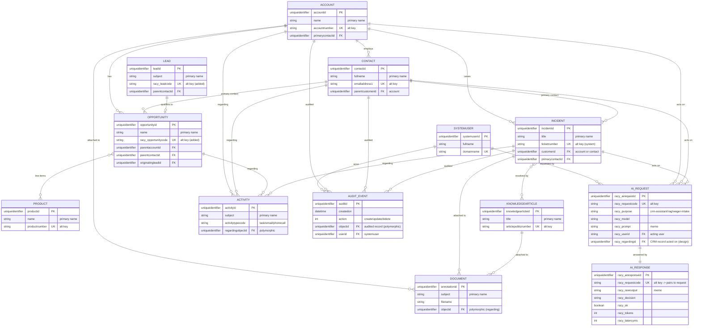

# Generic CRM — Entity-Relationship Diagram

Client-agnostic CRM domain (#8), modelled on **native Dataverse standard tables**
with custom `racy_` tables only for AI logging (ADR-0005). `UK` marks a
**Dataverse alternate key** (used for upsert); `PK` the GUID primary key; `FK` a
lookup. Cross-cutting entities (Activity, Document, Audit Event, AI Request) use
a **polymorphic** lookup that can point at several tables — see
[crm-schema-notes.md](../architecture/crm-schema-notes.md); only representative
edges are drawn here to keep the diagram legible.

## How to read it

- **`||--o{`** one-to-many · **`||--o|`** one-to-zero-or-one · **`}o--o{`**
  many-to-many · **`||--||`** one-to-one.
- **`UK`** = Dataverse **alternate key** — the natural business identifier used
  for idempotent upsert (seeding/integration), since standard tables key on a
  GUID `PK`. `(added)` marks alt keys that must be *created* on a standard table
  (they don't ship with a business-natural one).
- **Polymorphic** lookups (`regardingobjectid`, `objectid`,
  `racy_regardingid`) can target several tables; the drawn edges are
  representative, not exhaustive.

Detail — cascade behaviour, the polymorphic targets, and the AI ↔ CRM link — is
in [crm-schema-notes.md](../architecture/crm-schema-notes.md).
